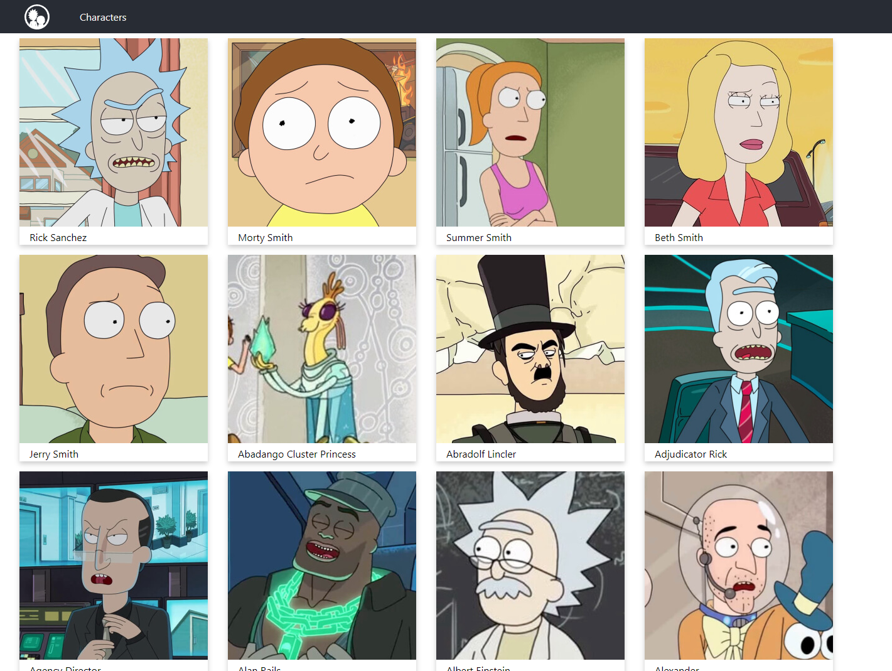
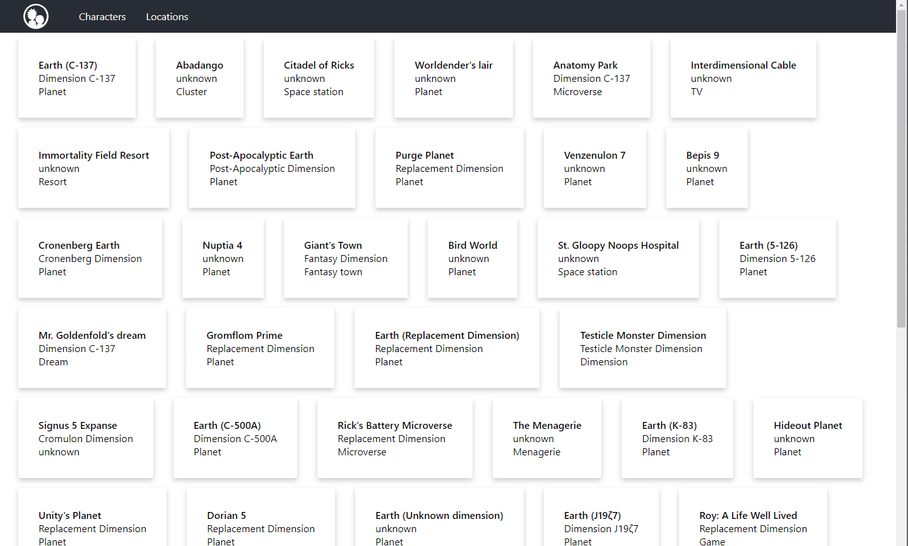

# Rick and Morty Api integration

First steps of the integration with https://rickandmortyapi.com/ api.

# Services

## Web

Url of website:
- http://localhost:3000

### Characters:

### Locations:

## Api

Exposes api endpoints:
- http://localhost:5008/api/characters
- http://localhost:5008/api/locations

## Etl - Character integration

Integrate entity of characters

## Etl - Locations integration

Integrate entity of locations
